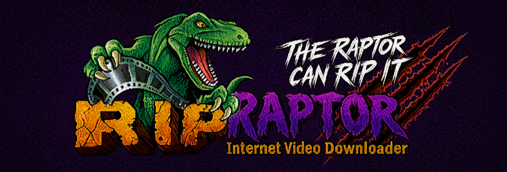

# Rip Raptor

A native macOS video downloader. Drop a URL in, get the file out. Built around `yt-dlp` and `ffmpeg`, wrapped in a Win98-themed UI with a built-in trim/concat editor.



---

## Install

1. Download the latest `Rip-Raptor-X.Y.Z.dmg` from [Releases](https://github.com/henri-cmd/ripraptor/releases).
2. Open the dmg and drag **Rip Raptor** into `/Applications`.
3. The first launch needs a right-click — see below.

### First-launch Gatekeeper warning

The 0.1 beta is **ad-hoc signed**, not Apple-notarized, so macOS will block the first launch. Two options:

**Recommended (works on Sequoia / Sonoma / Ventura):**

1. Try to open the app once — macOS shows a "can't be opened" dialog. Click **Done**.
2. Open **System Settings → Privacy & Security**.
3. Scroll to the security section — there's a banner *"'Rip Raptor' was blocked to protect your Mac"* with an **Open Anyway** button.
4. Click it, enter your password.
5. The app launches and the exception sticks forever.

> *Note:* The old "right-click → Open" trick was removed in macOS Sequoia (15). On Sequoia the right-click dialog only offers "Done" and "Move to Bin" — System Settings is the only path.

**One-liner via Terminal (any macOS):**

```sh
xattr -dr com.apple.quarantine "/Applications/Rip Raptor.app"
```

Strips the quarantine attribute outright. Double-click works after that.

## Requirements

- macOS 12 (Monterey) or newer
- Apple Silicon (M1/M2/M3/M4) — the bundled `ffmpeg`/`ffprobe` are arm64. Intel Macs aren't supported in 0.1.

## What's bundled

The dmg is fully self-contained for the common case. No Homebrew or pipx required.

| Tool | Version | Source |
|---|---|---|
| yt-dlp | 2026.03.17 | [yt-dlp/yt-dlp releases](https://github.com/yt-dlp/yt-dlp/releases) (universal `yt-dlp_macos`, has `curl_cffi` baked in) |
| ffmpeg | 8.1 | [osxexperts.net](https://www.osxexperts.net) (static arm64 build with VideoToolbox encoders) |
| ffprobe | 8.1 | osxexperts.net |

Total dmg size: ~50–60 MB compressed.

## Updates

- **App updates**: a cyan `Rip Raptor → vX.Y.Z` pill appears in the status bar when GitHub has a newer release. Click it to open the release page and download the new dmg.
- **yt-dlp updates**: an amber `yt-dlp → YYYY.MM.DD` pill appears when GitHub has a newer release. In 0.1 the in-app updater is wired for `pipx upgrade yt-dlp` only — bundled-binary swap is on the roadmap. For now, the pill is informational.

## Building from source

You'll need Xcode command-line tools (`xcode-select --install`) and Python 3.

```sh
git clone https://github.com/henri-cmd/ripraptor.git
cd ripraptor
tools/build-dmg.sh
# → dist/Rip-Raptor-0.1.0.dmg
```

The build script automatically runs `tools/fetch-vendor.sh` on a fresh clone to pull `yt-dlp`, `ffmpeg`, and `ffprobe` into `vendor/`. Re-run that script any time you want to refresh the bundled tool versions.

To build with a different version number, pass it as an argument: `tools/build-dmg.sh 0.1.1`. The script patches `src/app.py` and `resources/Info.plist` so all version-display surfaces stay in sync.

### Project layout

```
src/
  app.py               Python HTTP server + UI (single big file, ~10k lines)
  hls_fetcher.py       Helper for browser-fetched HLS manifests
  VideoDownloader.swift  Cocoa shell — WKWebView host with menu bar + About panel
resources/
  Info.plist           Bundle metadata (version is templated into here)
  AppIcon.icns
  banner.png           First-page splash
  get-ripped.png       Empty-state hero
  title.mp4            Launch animation
vendor/
  yt-dlp               Bundled standalone binary
  ffmpeg               Bundled static arm64 binary
  ffprobe              Bundled static arm64 binary
tools/
  build-dmg.sh         Reproducible release build
  pad_icon.swift       Helper for re-padding the .icns artwork
dist/
  Rip-Raptor-X.Y.Z.dmg Build output (gitignored)
```

### How the bundled-binary lookup works

At startup, `app.py` checks for `Contents/Resources/bin/{yt-dlp,ffmpeg,ffprobe}` first (`_BUNDLED_BIN_DIR`), then falls back to PATH. Running `python3 src/app.py` directly during development uses your system's `yt-dlp`/`ffmpeg` — no rebuild needed for Python edits.

## Credits

Created by Henri Scott.

Built on top of:
- [yt-dlp](https://github.com/yt-dlp/yt-dlp) (Unlicense / public domain)
- [ffmpeg](https://ffmpeg.org/) (LGPL / GPL depending on build)
- [curl_cffi](https://github.com/lexiforest/curl_cffi) (MIT)

## License

TBD — repo is currently private/personal.
